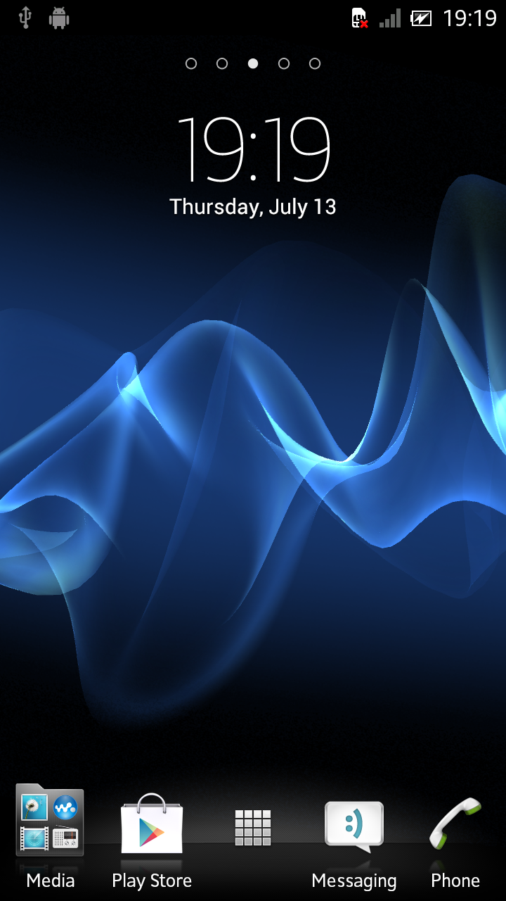
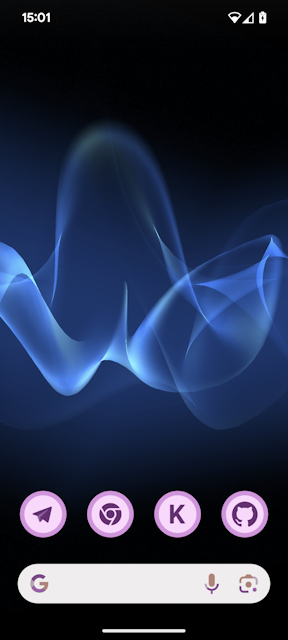
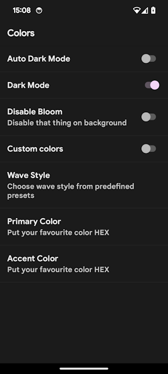

### What is it?

This project provides fixes for closed-source
live wallpaper from old sony smartphone

### How to build?

There is no source code, so you should generate
one by yourself

- Download APK file
  from [APKMirror link](https://www.apkmirror.com/apk/sony-mobile-communications/cosmic-flow/cosmic-flow-1-3-a-0-4-release/cosmic-flow-1-3-a-0-4-android-apk-download/)
- Check MD5 hash, Should
  be `CCA75A823CE69193E52E8E031742BAE3`
- Place APK file into `decompiler` folder
- Execute `decompile.bat`
- Wait for process to finish. Success message
  looks like
    ```
  Finished! 
    Now you can import project to IDE
    Window may be safely closed
    =)
  ```
- Now, project can be imported from IDE to build APK file by yourself

### Screenshots
Original



Rebuild



### What was changed

- Removed platform-specific code
- Bumped target SDK to 34
- Fixed shaders
- Implemented light mode
- Implemented Android 12 Monet colors
- Implemented settings gui



